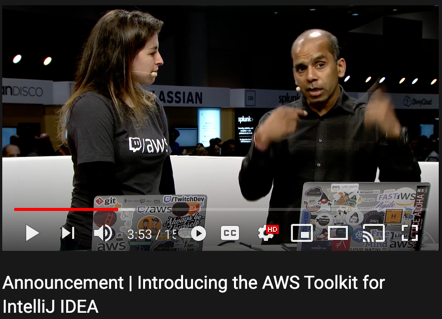

# TechLab
<!-- .slide: style="text-align: left;"> -->
AWS -> Lambda -> SAM -> AWS-Toolkit-Plugin

---

## AWS - Lambda
<!-- .slide: style="text-align: left;"> -->
- Kortlivade. Stateless <!-- .element: class="fragment" data-fragment-index="1" -->
- Java, Python, JS, etc .. <!-- .element: class="fragment" data-fragment-index="2" -->
- Triggas av event. T.ex. http anrop.<!-- .element: class="fragment" data-fragment-index="3" -->

---

## SAM - "Serverless Application Model"
<!-- .slide: style="text-align: left;"> -->
- "Serverless Applications" <!-- .element: class="fragment" data-fragment-index="1" -->
- SAM = SAM CLI + SAM Template Specification <!-- .element: class="fragment" data-fragment-index="2" -->
- Pros<!-- .element: class="fragment" data-fragment-index="3" -->
	- Enklare template fil<!-- .element: class="fragment" data-fragment-index="4" -->
	- Testa lokalt<!-- .element: class="fragment" data-fragment-index="5" -->

---

## AWS Toolkit
<!-- .slide: style="text-align: left;"> -->

<figure>
  
</figure>

* https://www.youtube.com/watch?v=xbbkNVr27Is

* https://aws.amazon.com/intellij/

---

# Demo

